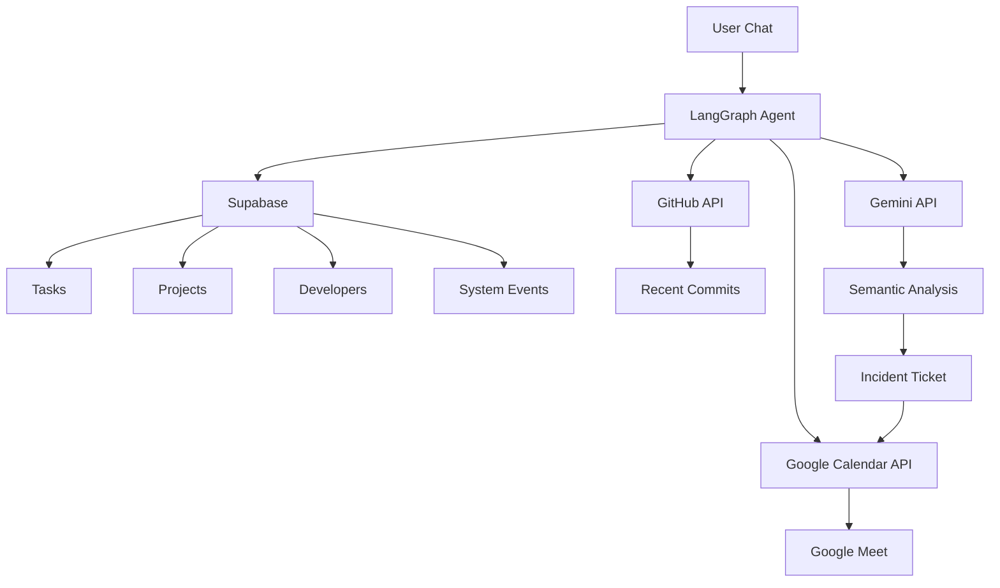
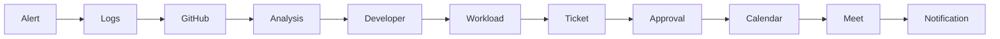

# 🤖 Autonomous Engineering Lead (AEL)


> **An AI-powered Site Reliability Engineer (SRE) + Scrum Master built with LangGraph that automates infrastructure diagnostics, workload management, and incident coordination.**

---

# 📌 Table of Contents

- [Overview](#overview)
- [Problem Statement](#problem-statement)
- [Solution](#solution)
- [Features](#features)
- [System Architecture](#system-architecture)
- [Golden Path Workflow](#golden-path-workflow)
- [Tech Stack](#tech-stack)
- [Database Schema](#database-schema)
- [Project Structure](#project-structure)
- [Installation](#installation)
- [Environment Variables](#environment-variables)
- [Running the Project](#running-the-project)
- [Edge Cases](#edge-cases)
- [Roadmap](#roadmap)
- [License](#license)

---

# Overview

The **Autonomous Engineering Lead (AEL)** is a LangGraph-powered AI agent that combines the responsibilities of a **Site Reliability Engineer (SRE)** and a **Scrum Master**.

Rather than simply responding to user commands, AEL proactively coordinates engineering operations by:

- Monitoring infrastructure alerts
- Tracking sprint workloads
- Investigating production failures
- Correlating crash logs with GitHub commits
- Logging incidents
- Scheduling remediation meetings

The goal is to reduce **Mean Time to Resolution (MTTR)** while eliminating repetitive engineering coordination.

---

# Problem Statement

Modern engineering teams rely on multiple tools:

- GitHub
- Monitoring Platforms
- Google Calendar
- Sprint Boards
- Incident Trackers

When a production incident occurs, engineers must manually:

- Read logs
- Search commits
- Identify responsible developers
- Check workloads
- Create tickets
- Schedule meetings

This process is slow, repetitive, and error-prone.

---

# Solution

AEL unifies all engineering operations into a single AI agent.

When an incident occurs, AEL automatically:

1. Reads crash logs
2. Retrieves recent GitHub commits
3. Performs semantic analysis
4. Identifies likely root cause
5. Finds responsible developer
6. Checks workload
7. Creates incident ticket
8. Schedules Google Meet
9. Requests approval before write actions

---

# Features

## 🚨 Infrastructure Monitoring

- Crash detection
- Alert investigation
- Error trace analysis

## 🧠 AI Root Cause Analysis

- Semantic comparison
- Commit correlation
- Infrastructure diagnosis

## 📋 Sprint Management

- Workload tracking
- Deadline monitoring
- Priority analysis

## 📅 Automated Scheduling

- Google Calendar integration
- Google Meet generation
- Team synchronization

## 📝 Incident Management

- Ticket generation
- Incident logging
- Historical tracking

## 🔄 Human-in-the-Loop

Sensitive write actions require user confirmation.

---

# System Architecture



---

# Golden Path Workflow



---

# Tech Stack

| Layer | Technology |
|--------|------------|
| Frontend | Next.js App Router |
| Styling | Tailwind CSS |
| UI | shadcn/ui |
| AI Framework | LangGraph.js |
| LLM | Google Gemini |
| Backend | Node.js |
| Database | Supabase PostgreSQL |
| Authentication | OAuth 2.0 |
| Hosting | Vercel |
| APIs | GitHub REST API, Google Workspace |

---

# Database Schema

## active_projects

| Column | Type |
|---------|------|
| project_id | UUID |
| project_name | Text |
| github_repo_url | Text |

---

## team_members

| Column | Type |
|---------|------|
| dev_id | UUID |
| name | Text |
| email_address | Text |
| github_username | Text |
| role | Text |

---

## sprint_tasks

| Column | Type |
|---------|------|
| task_id | UUID |
| project_id | UUID |
| assigned_dev_id | UUID |
| task_title | Text |
| status | Pending / In Progress / Completed |
| priority | Low / Medium / High / Critical |
| due_date | Timestamp |

---

## system_events

| Column | Type |
|---------|------|
| event_id | UUID |
| project_id | UUID |
| error_trace | Text |
| timestamp | Timestamp |

---

## incident_tickets

| Column | Type |
|---------|------|
| ticket_id | UUID |
| project_id | UUID |
| assigned_dev_id | UUID |
| error_context | Text |
| status | Open / Resolved |

---

# Project Structure

```
autonomous-engineering-lead/

│

├── app/

├── components/

├── lib/

│ ├── langgraph/

│ ├── github/

│ ├── google/

│ ├── supabase/

│ └── tools/

│

├── database/

├── prompts/

├── types/

├── public/

├── README.md

└── package.json
```

---

# Installation

```bash
git clone https://github.com/yourusername/autonomous-engineering-lead.git

cd autonomous-engineering-lead

npm install
```

---

# Environment Variables

Create a `.env.local`

```env
NEXT_PUBLIC_SUPABASE_URL=

NEXT_PUBLIC_SUPABASE_ANON_KEY=

SUPABASE_SERVICE_ROLE_KEY=

GITHUB_TOKEN=

GOOGLE_CLIENT_ID=

GOOGLE_CLIENT_SECRET=

GOOGLE_REDIRECT_URI=

GEMINI_API_KEY=
```

---

# Running the Project

Development

```bash
npm run dev
```

Production

```bash
npm run build

npm start
```

---

# Example Interaction

### User

```
Investigate the latest production crash.
```

### Agent

```
✅ Retrieved latest system alert.

✅ Fetched recent GitHub commits.

✅ Correlated stack trace with commit
"Fix Payment API Authentication"

Responsible Developer:
Muhammad Husnain

Current Workload:
3 Critical Tasks

Recommendation:
Would you like to assign this incident
or reassign it?

Proceed?
```

---

# Edge Cases

## Workload Overload

If the responsible developer already has multiple overdue critical tasks:

> "Developer workload exceeds threshold. Should this incident be reassigned?"

---

## Semantic Mismatch

If commits don't match the error:

> "This appears to be an infrastructure-level failure."

---

## Missing Identity

If the GitHub username isn't mapped:

> "Unable to locate corporate email for this developer."

---

## API Failure

Gracefully handles:

- GitHub Rate Limits
- Google API Failures
- Network Timeouts

---

## Human Approval

Before:

- Sending emails
- Scheduling meetings
- Creating tickets

The agent always requests confirmation.

---

# Future Roadmap

- Slack Integration
- Microsoft Teams
- Jira Integration
- Linear Integration
- Multi-Agent Collaboration
- Automatic Rollback Suggestions
- Predictive Incident Detection
- Self-Healing Infrastructure
- CI/CD Integration
- Executive Dashboard

---

# Demo Workflow

```
Crash Detected
      │
      ▼
Read Logs
      │
      ▼
Fetch GitHub Commits
      │
      ▼
Semantic Analysis
      │
      ▼
Identify Developer
      │
      ▼
Check Sprint Workload
      │
      ▼
Create Ticket
      │
      ▼
Request Approval
      │
      ▼
Schedule Google Meet
```

---

# Contributors

**Muhammad Abdullah Ahmad**

AI Engineer | Full Stack Developer

---

# License

This project is licensed under the MIT License.
