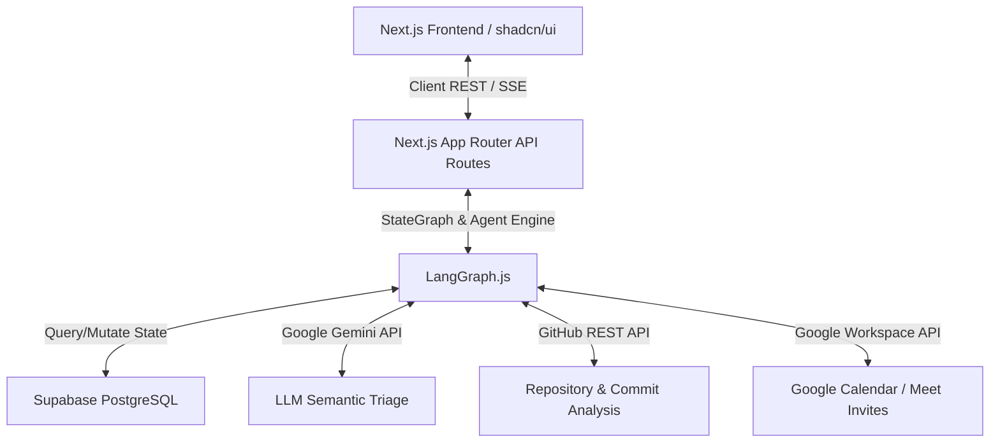

# Environment Setup Guide: The Autonomous Engineering Lead (AEL) Agent

Welcome. This document details the step-by-step process to stand up the local development, API integration, and database environment for the **Autonomous Engineering Lead (AEL) Agent**. 

Given our target delivery date of **July 5, 2026**, this guide has been designed to get your workspace fully operational in under 30 minutes, keeping clean separation of concerns and ensuring production-level standards.

---

## Architecture Blueprint



---

## Phase 1: Local Prerequisites & Tooling

Before creating the project structure, ensure your local development machine has the following tools installed and updated:

1. **Node.js (v20.x or higher LTS)**: LangGraph.js and Next.js App Router require a modern Node.js runtime.
   - Verify: `node -v`
2. **Git**: For version control and GitHub API sync test.
   - Verify: `git --version`
3. **Supabase CLI (Recommended)**: For local PostgreSQL emulation and database migrations.
   Choose one of the following methods to install on Windows:
   - **Option A (NPM - Easiest as you have Node.js installed)**:
     ```powershell
     npm install -g supabase
     ```
   - **Option B (Windows Package Manager - winget)**:
     ```powershell
     winget install supabase.supabase
     ```
   - **Option C (Scoop)**: If you prefer Scoop, install Scoop first by running:
     ```powershell
     Set-ExecutionPolicy -ExecutionPolicy RemoteSigned -Scope Process
     iwr -useb get.scoop.sh | iex
     ```
     Once Scoop is installed, run:
     ```powershell
     scoop bucket add supabase; scoop install supabase
     ```
   - Verify: `supabase --version`
4. **PostgreSQL Client (Optional)**: `psql` or a tool like DBeaver for direct database query verification.

---

## Phase 2: Project Scaffolding

We will scaffold a modern Next.js project. We will configure **Tailwind CSS**, initialize **shadcn/ui**, and install the core backend and agent dependencies.

### Step 2.1: Initialize Next.js App
Run the following commands in your terminal to initialize Next.js in the root of the workspace directory (`f:\z361`):

```powershell
# Create the Next.js app inside the current directory (non-interactive, with defaults)
npx -y create-next-app@latest ./ --typescript --tailwind --eslint --app --src-dir --import-alias "@/*"
```

### Step 2.2: Initialize shadcn/ui
Run the initialization command for `shadcn-ui` to configure UI components:

```powershell
npx -y shadcn-ui@latest init
```
*Recommended answers to prompts:*
- Style: **Default**
- Base Color: **Slate** or **Zinc**
- CSS Variables for colors: **Yes**

Install required basic UI components:
```powershell
npx -y shadcn-ui@latest add button card dialog input label toast select scroll-area table
```

### Step 2.3: Install Core Backend & Agent Dependencies
Install the package ecosystem required for LangGraph, Supabase, LLMs, and external API requests:

```powershell
npm install @langchain/langgraph @langchain/google-genai @supabase/supabase-js octokit googleapis dotenv zod
```

---

## Phase 3: Supabase Database Setup & Schema

The AEL agent relies on a relational schema in PostgreSQL (Supabase) to keep track of team identities, project mappings, task status, alerts, and incident logs.

### Step 3.1: Initialize Supabase Locally (Optional)
If you prefer running a local Supabase environment (highly recommended for rapid offline development):
```powershell
supabase init
supabase start
```
*This will spin up local Docker containers running PostgreSQL, GoTrue (Auth), Realtime, and the Supabase Studio dashboard on `http://localhost:54323`.*

### Step 3.2: SQL Schema DDL (Source of Truth)
Execute the following SQL in your Supabase SQL Editor (either on the cloud console or on your local Studio):

```sql
-- Enable UUID generator extension
CREATE EXTENSION IF NOT EXISTS "uuid-ossp";

-- 1. Active Projects Table
CREATE TABLE active_projects (
    project_id UUID PRIMARY KEY DEFAULT uuid_generate_v4(),
    project_name VARCHAR(255) NOT NULL,
    github_repo_url VARCHAR(512) NOT NULL,
    created_at TIMESTAMPTZ DEFAULT NOW()
);

-- 2. Team Members Table
CREATE TABLE team_members (
    dev_id UUID PRIMARY KEY DEFAULT uuid_generate_v4(),
    name VARCHAR(255) NOT NULL,
    email_address VARCHAR(255) UNIQUE NOT NULL,
    github_username VARCHAR(255) UNIQUE NOT NULL,
    role VARCHAR(100),
    created_at TIMESTAMPTZ DEFAULT NOW()
);

-- 3. Sprint Tasks Table (Workload Management)
CREATE TABLE sprint_tasks (
    task_id UUID PRIMARY KEY DEFAULT uuid_generate_v4(),
    project_id UUID REFERENCES active_projects(project_id) ON DELETE CASCADE,
    assigned_dev_id UUID REFERENCES team_members(dev_id) ON DELETE SET NULL,
    task_title VARCHAR(255) NOT NULL,
    status VARCHAR(50) NOT NULL CONSTRAINT check_task_status CHECK (status IN ('Pending', 'In Progress', 'Completed')),
    priority VARCHAR(50) NOT NULL CONSTRAINT check_task_priority CHECK (priority IN ('Low', 'Medium', 'High', 'Critical')),
    due_date TIMESTAMPTZ NOT NULL,
    created_at TIMESTAMPTZ DEFAULT NOW()
);

-- 4. System Events Table (Infrastructure Crash / Diagnostics)
CREATE TABLE system_events (
    event_id UUID PRIMARY KEY DEFAULT uuid_generate_v4(),
    project_id UUID REFERENCES active_projects(project_id) ON DELETE CASCADE,
    error_trace TEXT NOT NULL,
    timestamp TIMESTAMPTZ DEFAULT NOW()
);

-- 5. Incident Tickets Table
CREATE TABLE incident_tickets (
    ticket_id UUID PRIMARY KEY DEFAULT uuid_generate_v4(),
    project_id UUID REFERENCES active_projects(project_id) ON DELETE CASCADE,
    assigned_dev_id UUID REFERENCES team_members(dev_id) ON DELETE SET NULL,
    error_context TEXT NOT NULL,
    status VARCHAR(50) NOT NULL CONSTRAINT check_ticket_status CHECK (status IN ('Open', 'Resolved')),
    created_at TIMESTAMPTZ DEFAULT NOW()
);

-- Seed Data (For testing "The Golden Path" standup and DevOps triggers)
INSERT INTO active_projects (project_id, project_name, github_repo_url) VALUES 
('11111111-1111-1111-1111-111111111111', 'Payment Gateway API', 'https://github.com/example/payment-gateway'),
('22222222-2222-2222-2222-222222222222', 'Z360 Core App', 'https://github.com/example/z360-core');

INSERT INTO team_members (dev_id, name, email_address, github_username, role) VALUES
('aaaaaaaa-aaaa-aaaa-aaaa-aaaaaaaaaaaa', 'M. Husnain', 'husnain@z360.co', 'husnain-dev', 'Backend Engineer'),
('bbbbbbbb-bbbb-bbbb-bbbb-bbbbbbbbbbbb', 'Hamza', 'hamza@z360.co', 'hamza-git', 'Full Stack Developer'),
('cccccccc-cccc-cccc-cccc-cccccccccccc', 'M. Abdullah Ahmad', 'abdullah@z360.co', 'abdullah-lead', 'Lead Engineer');

INSERT INTO sprint_tasks (project_id, assigned_dev_id, task_title, status, priority, due_date) VALUES
('11111111-1111-1111-1111-111111111111', 'aaaaaaaa-aaaa-aaaa-aaaa-aaaaaaaaaaaa', 'Payment API Integrations', 'Pending', 'Critical', NOW() - INTERVAL '1 day'),
('22222222-2222-2222-2222-222222222222', 'bbbbbbbb-bbbb-bbbb-bbbb-bbbbbbbbbbbb', 'Setup Docker files', 'Pending', 'Medium', NOW() + INTERVAL '1 day'),
('22222222-2222-2222-2222-222222222222', 'bbbbbbbb-bbbb-bbbb-bbbb-bbbbbbbbbbbb', 'Implement OAuth 2.0 Login UI', 'Pending', 'Medium', NOW() + INTERVAL '1 day');

INSERT INTO system_events (project_id, error_trace, timestamp) VALUES
('11111111-1111-1111-1111-111111111111', 'FATAL: database system is shutting down. Connection refused at index.js:42. Connection pool exhausted for pg_pool.', NOW());
```

---

## Phase 4: API & Credentials Configurations

To fulfill AEL's core flows (Gemini, GitHub commit parsing, and Workspace API meeting creation), config files or credentials must be established for each downstream connection:

### 1. Google Gemini API
AEL uses Gemini for semantic mapping and natural language processing.
1. Visit the [Google AI Studio Console](https://aistudio.google.com/).
2. Click **Get API Key** and generate an API key.
3. Save this value as `GEMINI_API_KEY`.

### 2. GitHub REST API (Read-only Token)
The agent reads commits to find out who broke the build.
1. Log into your GitHub account and navigate to **Settings -> Developer Settings -> Personal Access Tokens (classic)**.
2. Generate a new token with the `repo` scope (or `public_repo` if you only plan to read public codebases).
3. Copy the token and save it as `GITHUB_PAT`.

### 3. Google Workspace APIs (OAuth 2.0 Web Flow vs. Service Account)
Google Workspace APIs do not natively support standard *Client Credentials* flow for individual Google Accounts. Instead, you have two primary options:

#### Option A: Three-Legged OAuth 2.0 Web Flow (Highly Recommended for Local Dev)
Allows the agent to act on behalf of the logged-in User/Scrum Master.
1. Open the [Google Cloud Console](https://console.cloud.google.com/).
2. Create a new project named `AEL-Agent`.
3. Enable the **Google Calendar API** for your project.
4. Set up your **OAuth consent screen** (Internal or External/Testing) and add the scope `https://www.googleapis.com/auth/calendar` and `https://www.googleapis.com/auth/calendar.events`.
5. Navigate to **Credentials** -> **Create Credentials** -> **OAuth client ID**.
6. Set the Application type to **Web application** and add authorized redirect URIs:
   - `http://localhost:3000/api/auth/callback/google` (if building custom auth)
   - `https://developers.google.com/oauthplayground` (for quick testing token generation)
7. Save the `GOOGLE_CLIENT_ID` and `GOOGLE_CLIENT_SECRET`.

#### Option B: Google Service Account with Domain-Wide Delegation
Allows the backend to programmatically write calendars for any user under a custom Google Workspace domain without manual authorization prompts.
1. In the Google Cloud Console, navigate to **IAM & Admin** -> **Service Accounts**.
2. Click **Create Service Account**, generate a key file in JSON format, and store it securely.
3. In the Google Workspace Admin Console (`admin.google.com`), go to **Security** -> **Access and data control** -> **API controls** -> **Manage Domain Wide Delegation**.
4. Register the Client ID of the service account and assign the scope: `https://www.googleapis.com/auth/calendar` and `https://www.googleapis.com/auth/calendar.events`.
5. In your `.env.local`, load this private key configuration.

---

## Phase 5: Environment Variables Config

Create a `.env.local` file in the root of your Next.js application directory (`f:\z361\.env.local`) and configure the following variables:

```bash
# Next.js Public Keys (if needed client-side)
NEXT_PUBLIC_SUPABASE_URL=https://your-project-id.supabase.co
NEXT_PUBLIC_SUPABASE_ANON_KEY=your-supabase-anon-key

# Supabase Admin / Service Key (needed for server-side operations bypassing RLS)
SUPABASE_SERVICE_ROLE_KEY=your-supabase-service-role-key

# LLM Configuration
GEMINI_API_KEY=your_gemini_api_key

# GitHub Token (for repository code/commit diagnostics)
GITHUB_PAT=your_github_personal_access_token

# Google Calendar Integration (OAuth Web Flow)
GOOGLE_CLIENT_ID=your_google_oauth_client_id
GOOGLE_CLIENT_SECRET=your_google_oauth_client_secret
GOOGLE_REDIRECT_URI=http://localhost:3000/api/auth/callback/google

# Google Refresh Token (if bypassing OAuth screens on every run during testing)
GOOGLE_REFRESH_TOKEN=your_oauth_refresh_token_for_offline_access

# Node environment settings
NODE_ENV=development
```

---

## Phase 6: LangGraph State & Checkpointer Design

Because AEL operates as a Next.js serverless application, standard in-memory LangGraph checkpointers (`MemorySaver`) will clear state whenever the serverless lambda scales down.

### Recommendations for Serverless Checkpointer Setup:
Instead of in-memory memory storage, implement a database-backed checkpointer. Since you are already using Supabase (PostgreSQL), install and use the `@langchain/langgraph-checkpoint-postgres` engine:

```typescript
import { SqliteSaver } from "@langchain/langgraph-checkpoint-sqlite"; // Local mock checking
import { PostgresSaver } from "@langchain/langgraph-checkpoint-postgres"; // Production checking

// Initialize Postgres checkpointer using your Supabase Postgres Connection String
const checkpointer = PostgresSaver.fromConnString(
  process.env.SUPABASE_DATABASE_CONNECTION_STRING!
);

// Compiling the StateGraph with persistence
const app = workflow.compile({ checkpointer });
```

---

## Phase 7: Verification Checklist

Verify your setup is functional by executing these checks:

| Service | Test Action | Verification Metric |
| :--- | :--- | :--- |
| **Supabase** | `supabase db ping` or run a fetch on `active_projects` | Handshake completes with HTTP 200 |
| **Gemini API** | Run curl/fetch request targeting `gemini-1.5-pro` or `gemini-2.0` | Returns valid JSON text generation |
| **GitHub API** | Request repo commits via Octokit: `octokit.rest.repos.listCommits()` | Returns commit payload matching mock repository |
| **Google Calendar** | Call Calendar API with authorized OAuth client | Receives valid Calendar Event ID with Meet URL |

---

## Phase 8: Production Live Logging (Hobby-Tier Error Capture)

The AEL agent relies on live logs to diagnose crashes. Since Vercel Log Drains require a paid **Vercel Pro** subscription, our template includes an application-level logging architecture designed to operate for free on the Vercel Hobby tier.

### Step 8.1: Server-Side Logger Utility
We use the global helper function `logSystemEvent` defined in `src/lib/logger.ts` to log serverless API route failures and backend crashes directly to the Supabase `system_events` table.
*Usage inside API routes:*
```typescript
import { logSystemEvent } from "@/lib/logger";

try {
  // your backend operations
} catch (error: any) {
  await logSystemEvent(`[API Crash] ${error.message}\nStack: ${error.stack}`);
  return Response.json({ error: error.message }, { status: 500 });
}
```

### Step 8.2: Client-Side Error boundary
We intercept client-side React UI rendering crashes using the Next.js global error boundary configured in `src/app/error.tsx`. When a frontend crash occurs:
1. The error details and stack trace are formatted.
2. The browser automatically sends a `POST` request to our local reporting API endpoint at `/api/logs/report`.
3. The endpoint writes the error event straight to your Supabase `system_events` table.

---

You are now fully set up to write the Agent Logic nodes, routing states, and the human-in-the-loop approval workflows. Good luck with the challenge!
