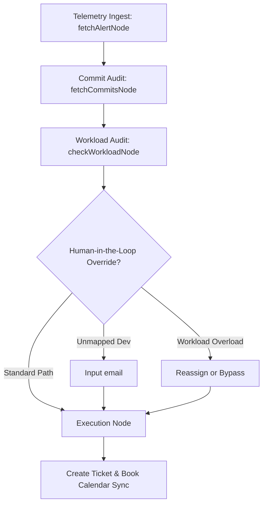

# Technical Submission Note: AEL Autonomous Engineering Lead

Thank you for reviewing our submission. This document outlines our architectural decisions, complete system features, core state machine flows, database synchronization strategies, engineering tradeoffs, and deployment configurations.

---

## 🔗 Live Links & Repository

* **Live Vercel Application:** [https://autonomous-engineering-lead.vercel.app/](https://autonomous-engineering-lead.vercel.app/)
* **GitHub Repository:** [https://github.com/malikabdullah1786/Ael-automatic-engineer-lead](https://github.com/malikabdullah1786/Ael-automatic-engineer-lead)

---

## 🏗️ System Architecture & State Flow

The core backend agent is powered by a **LangGraph State Machine** executing in Next.js Route Handlers. The workflow proceeds through the following deterministic checkpoints:

### 1. Telemetry Ingest (`fetchAlertNode`)
* **Action**: Ingests server exception logs or React frontend exceptions from Supabase.
* **De-duplication**: Filters out crashes that have already been triaged. It queries all historical tickets, strips calendar event prefixes, and matches context snippets, preventing ticket duplication.

### 2. Git Commit Audit (`fetchCommitsNode`)
* **Action**: Fetches Git commits using GitHub's Octokit API.
* **Auditing**: Semantic audit compares the crash trace header and stack lines against the files modified in recent commits to identify the regression author.

### 3. Workload Scanning & Human-in-the-Loop Safeguards (`checkWorkloadNode` / `executeActionNode`)
* **Action**: Checks developer task boards. If the culprit developer has $\ge 3$ critical or overdue tasks, a workload warning is raised.
* **Interrupts**: Pauses state execution to request human overrides for:
  * `unmapped_identity`: The culprit author is not registered in the team database.
  * `workload_overload`: The culprit developer's queue is overloaded.
  * `human_approval_required`: A calendar meeting booking requires direct confirmation.

### 4. Remediation Scheduling (`executeActionNode`)
* **Action**: Creates a Jira/remediation ticket, schedules a Google Calendar event, and attaches a Google Meet invitation link dynamically to the chat feed.

---

## 🌟 Complete Feature List & Capabilities

### 1. Real-Time Telemetry & Log Ingest
* Ingests both server-side lambda crashes and client-side web errors.
* Automatically records events in Supabase with context, timestamp, project key, and raw stack traces.

### 2. React Error Boundary Interceptor
* A custom frontend error boundary component captures uncaught React rendering crashes.
* Automatically sends UI crash stack traces to the telemetry endpoint `/api/logs` for real-time triage.

### 3. AI-Powered Git Auditing (Developer Attribution)
* Scans the repository's git commit logs dynamically via GitHub Octokit API.
* Utilizes Google Gemini (`gemini-3.1-flash-lite`) to run semantic classification, mapping crash call stacks to specific code diffs and commit hashes to identify the most likely author of the bug.

### 4. Corporate Directory Identity Resolution
* Resolves the identified git author to a corporate directory database.
* Cross-references usernames to find corporate email addresses, real names, and active project settings.

### 5. Jira REST API Synchronization
* Automates ticket workflows by opening engineering tickets directly in your Jira Cloud instance.
* Maps local project context to the corresponding Jira Project Key and assigns the ticket to the identified developer.

### 6. Automated Google Calendar & Meet Sync
* Automatically books a 15-minute 1-on-1 incident response sync on the developer's calendar.
* Provisions a Google Meet video conference link dynamically and embeds it in the invite and event summary.

### 7. Overload & Conflict Safeguards
* Calculates assignee workload and issues warning indicators if the developer has 3 or more open critical/overdue sprint items.
* Scans the database for meeting conflicts at the drafted slot to prevent overlapping meeting blocks.

### 8. Proactive Sprint Standup Remediation
* Runs active audits on sprint task boards to detect overdue deliverables.
* Recommends batch remediation meeting scheduling directly to project managers and organization leads.

### 9. Multi-Turn Conversational Co-Pilot
* Uses a LangGraph chat assistant to let users assign projects, adjust developer contact emails, and schedule custom standup check-ins using natural language.

---

## 🛠️ Key Technical Decisions

### 1. Stateless Serverless Persistence (`SupabaseCheckpointer`)
* **Decision**: We designed and implemented a custom **`SupabaseCheckpointer`** that inherits from LangGraph's `MemorySaver`. It stores serialized agent thread states in the Supabase `system_settings` table under the `agent_checkpoints` key. This allows different serverless lambda instances on Vercel to maintain multi-turn conversation states.

### 2. Hybrid State Storage (Database + LocalStorage)
* **Why**: We synchronized chat threads via Next.js `/api/chat` into Supabase. If the database is unreachable, it seamlessly falls back to `localStorage`. This guarantees persistent chat history and a bulletproof offline/fallback state.

### 3. Connection Pooling for Supabase (IPv4 Transition)
* **Why**: Since Supabase direct database connection hostnames resolve strictly to IPv6, serverless environments (or IPv4 local developer networks) frequently fail with `getaddrinfo ENOTFOUND`. 
* **Decision**: We configured the project to route SQL traffic through the Supabase **Supavisor connection pooler** (`aws-0-[region].pooler.supabase.com:6543`), enabling robust IPv4 compatibility and connection management.

### 4. Regex Prefix Sanitization
* **Why**: When scheduling a meeting, the calendar sync prepends `[Scheduled: ...]` to the ticket context. Simple substring checks would fail and triage the crash again. 
* **Decision**: We implemented a prefix-stripping regex replacement `/^\[Scheduled:[^\]]+\]\s*/` to isolate raw stack traces for exact comparisons.

---

## ⚖️ Tradeoffs Made

* **Truncated Jira Summaries**: Jira Cloud restricts summaries to $\le 255$ characters. We strip newlines and truncate to 250 characters, preventing REST validation errors.
* **Synchronous database checkpointer updates**: While DB roundtrips add a slight latency (~200ms) to graph execution, it is essential to ensure state consistency across stateless serverless endpoints.

---

## 🧪 Verification Plan

### 1. Automated Validation
* **Compilation & Build**: Verified with a production build (`npm run build`). No TypeScript compilation or ESLint errors.
* **Postgres Connection**: Verified connectivity against the pooler connection string.

### 2. Manual Verification Path
1. **Mock Telemetry Ingestion**: Click **Mock Server Crash** in the header.
2. **Autonomous Triaging**: Open **AEL Co-Pilot Chat** and type `Investigate the latest crash`.
3. **Human Intercept**: Verify the agent intercepts unmapped emails or workload warnings, waiting for developer input.
4. **Meeting Booking**: Specify the meeting time (e.g. `tomorrow at 5 PM`), approve the remediation, and watch AEL file the ticket and share the Meet link.
