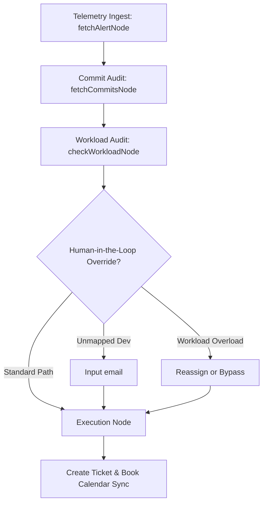

# Technical Submission Note: AEL Autonomous Engineering Lead

Thank you for reviewing our submission. This document outlines our architectural decisions, core state machine flows, database synchronization strategies, and engineering tradeoffs.

## 🚀 Overview

**AEL (Autonomous Engineering Lead)** is a production-grade, stateful SRE agent designed to orchestrate the entire lifecycle of system telemetry ingest, regression audit, workload monitoring, human override guards, and calendar scheduling.

---

## 🏗️ System Architecture & State Flow

The core backend agent is powered by a **LangGraph State Machine** executing in Next.js Route Handlers. The workflow proceeds through the following deterministic checkpoints:

### 1. Telemetry Ingest (`fetchAlertNode`)
*   **Action**: Ingests server exception logs or React frontend exceptions from Supabase.
*   **De-duplication**: Filters out crashes that have already been triaged. It queries all historical tickets, strips calendar event prefixes, and matches context snippets, preventing ticket duplication.

### 2. Git Commit Audit (`fetchCommitsNode`)
*   **Action**: Fetches Git commits using GitHub's Octokit API.
*   **Auditing**: Semantic audit compares the crash trace header and stack lines against the files modified in recent commits to identify the regression author.

### 3. Workload Scanning & Human-in-the-Loop Safeguards (`checkWorkloadNode` / `executeActionNode`)
*   **Action**: Checks developer task boards. If the culprit developer has $\ge 3$ critical or overdue tasks, a workload warning is raised.
*   **Interrupts**: Pauses state execution to request human overrides for:
    *   `unmapped_identity`: The culprit author is not registered in the team database.
    *   `workload_overload`: The culprit developer's queue is overloaded.
    *   `human_approval_required`: A calendar meeting booking requires direct confirmation.

### 4. Remediation Scheduling (`executeActionNode`)
*   **Action**: Creates a Jira/remediation ticket, schedules a Google Calendar event, and attaches a Google Meet invitation link dynamically to the chat feed.

---

## 🛠️ Key Technical Decisions

### 1. Hybrid State Storage (Database + LocalStorage)
*   **Why**: We synchronized chat threads via Next.js `/api/chat` into Supabase. If the database is unreachable, it seamlessly falls back to `localStorage`. This guarantees persistent chat history and a bulletproof offline/fallback state.

### 2. Connection Pooling for Supabase (IPv4 Transition)
*   **Why**: Since Supabase direct database connection hostnames resolve strictly to IPv6 (`AAAA` records), serverless environments (or IPv4 local developer networks) frequently fail with `getaddrinfo ENOTFOUND`. 
*   **Decision**: We configured the project to route SQL traffic through the Supabase **Supavisor connection pooler** (`aws-0-[region].pooler.supabase.com:6543`), enabling robust IPv4 compatibility and connection management.

### 3. Regex Prefix Sanitization
*   **Why**: When scheduling a meeting, the calendar sync prepends `[Scheduled: ...]` to the ticket context. Simple substring checks would fail and triage the crash again. 
*   **Decision**: We implemented a prefix-stripping regex replacement `/^\[Scheduled:[^\]]+\]\s*/` to isolate raw stack traces for exact comparisons.

---

## ⚖️ Tradeoffs Made

*   **In-Memory/File Checkpointer vs DB Checkpointer**: We implemented the LangGraph checkpointer using a persistent JSON file (`ael_checkpoints.json`). While an SQL checkpointer is ideal for horizontal scaling, the local file checkpointer offers immediate disk-based state recovery for Next.js hot-reloads and development cycles without adding database overhead.
*   **Truncated Jira Summaries**: Jira Cloud restricts issue summaries to a single line ($\le 255$ characters). Rather than passing raw multi-line traces, we strip carriage returns/newlines and truncate to 250 characters, gracefully preventing REST validation errors.

---

## 🧪 Verification Plan

### 1. Automated Validation
*   **Compilation & Build**: Verified with a production build (`npm run build`). No TypeScript compilation or ESLint errors.
*   **Postgres Connection**: Verified connectivity against the pooler connection string.

### 2. Manual Verification Path
1.  **Mock Telemetry Ingestion**: Click **Mock Server Crash** in the header.
2.  **Autonomous Triaging**: Open **AEL Co-Pilot Chat** and type `Investigate the latest crash`.
3.  **Human Intercept**: Verify the agent intercepts unmapped emails or workload warnings, waiting for developer input.
4.  **Meeting Booking**: Approve the remediation and watch AEL file the ticket and share the Meet link.
