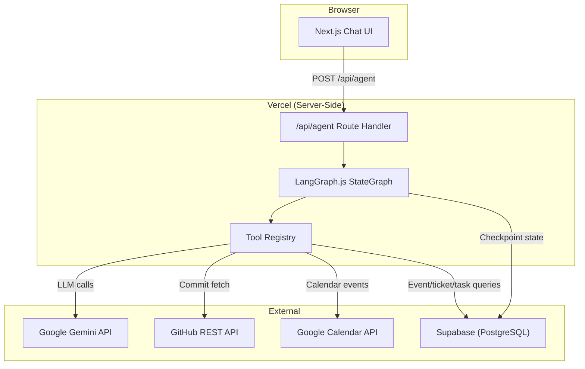

# Design Document: Autonomous Engineering Lead (AEL)

## Overview

The Autonomous Engineering Lead is a full-stack AI-powered web application that acts as a virtual SRE and Scrum Master. It combines a Next.js frontend, a LangGraph.js-powered agentic backend, Supabase (PostgreSQL) for persistence, and Google Gemini as the LLM engine.

The core value proposition is a conversational interface where a user can trigger complex multi-step workflows — such as ingesting a system alert, identifying the causal commit, resolving the responsible developer, logging an incident ticket, and scheduling a remediation meeting — through natural language. The agent handles orchestration, tool invocation, and state persistence; the user retains control through Human-in-the-Loop (HITL) checkpoints before irreversible external actions.

A secondary capability provides daily standup and sprint triage: the agent queries active sprint tasks, surfaces overdue and critical items, and proactively suggests scheduling follow-up syncs.

### Key Design Goals

- **Determinism and inspectability**: Model the entire agent workflow as a LangGraph.js `StateGraph` so every step is a named node with explicit transitions.
- **Resumability**: Persist agent state to Supabase after every node so multi-turn conversations can continue from where they left off.
- **Zero credential leakage**: All API keys are server-side only; the browser never touches secrets.
- **Accessibility**: The chat UI is fully keyboard-operable.
- **Publicly deployable**: Everything runs on Vercel + Supabase with no local setup by the evaluator.

---

## Architecture

The system is divided into three distinct layers.



### Layer Responsibilities

**Presentation Layer (Next.js App Router)**
- Renders the chat interface at the root path (`/`).
- POSTs each user message to `/api/agent`.
- Receives a streamed or JSON response and appends it to the message history.
- Displays HITL confirmation prompts with Confirm/Cancel controls.

**Agent Layer (LangGraph.js)**
- Implements the `StateGraph` with all workflow nodes and conditional edges.
- Manages a typed `AgentState` annotation that flows through all nodes.
- Delegates LLM calls through the `@langchain/google-genai` adapter.
- Pauses at HITL interrupt nodes and waits for the next user message to resume.

**Data Layer (Supabase)**
- Stores all business data: projects, team members, system events, incident tickets, sprint tasks.
- Hosts the LangGraph checkpointer tables (`langgraph_checkpoints`, `langgraph_writes`, `langgraph_migrations`) through the `@langchain/langgraph-checkpoint-supabase` adapter.

---

## Components and Interfaces

### 1. Chat Interface Component (`src/components/chat/`)

**ChatContainer** — top-level component managing local message state and submitting to `/api/agent`.

```typescript
interface ChatMessage {
  id: string;
  role: "user" | "assistant";
  content: string;
  structuredData?: IncidentSummary | TaskList | null;
  hitlPrompt?: HitlPrompt | null;
  timestamp: Date;
}

interface HitlPrompt {
  message: string;
  threadId: string;
}
```

**MessageList** — scrollable list; auto-scrolls to bottom on new messages.

**MessageInput** — controlled `<textarea>` with Enter-to-submit (Shift+Enter for newline). All controls reachable by Tab, activated by Enter/Space.

**HitlConfirmation** — renders when `hitlPrompt` is set on the last assistant message. Emits `confirm` or `cancel` to the parent, which POSTs back to `/api/agent` with `action: "confirm" | "cancel"`.

**StructuredDataRenderer** — renders `IncidentSummary` or `TaskList` payloads as formatted tables/cards instead of raw text.

### 2. API Route (`src/app/api/agent/route.ts`)

Single `POST` handler. Reads `SUPABASE_URL`, `SUPABASE_SERVICE_ROLE_KEY`, `GITHUB_PAT`, `GOOGLE_CLIENT_ID`, `GOOGLE_CLIENT_SECRET`, `GOOGLE_REFRESH_TOKEN`, and `GOOGLE_GEMINI_API_KEY` from `process.env`. Never serializes secrets into the response.

```typescript
// Request body shapes
type AgentRequest =
  | { type: "message"; threadId: string; content: string }
  | { type: "hitl"; threadId: string; action: "confirm" | "cancel" };

// Response body
interface AgentResponse {
  threadId: string;
  message: string;
  structuredData?: unknown;
  hitlPrompt?: HitlPrompt;
}
```

### 3. LangGraph Agent (`src/agent/`)

#### State Annotation

```typescript
import { Annotation } from "@langchain/langgraph";

const AgentState = Annotation.Root({
  messages: Annotation<BaseMessage[]>({
    reducer: (x, y) => x.concat(y),
    default: () => [],
  }),
  systemEvent: Annotation<SystemEvent | null>({ default: () => null }),
  commits: Annotation<Commit[]>({ default: () => [] }),
  triageResult: Annotation<TriageResult | null>({ default: () => null }),
  resolvedDev: Annotation<ResolvedDev | null>({ default: () => null }),
  incidentTicket: Annotation<IncidentTicket | null>({ default: () => null }),
  sprintSummary: Annotation<SprintSummary | null>({ default: () => null }),
  workflowPath: Annotation<"golden" | "standup" | "idle">({
    default: () => "idle",
  }),
  hitlPending: Annotation<boolean>({ default: () => false }),
});
```

#### StateGraph Nodes

| Node | Responsibility |
|---|---|
| `router` | LLM classifies user intent: `golden_path` or `standup` |
| `ingest_event` | Queries `system_events` for the most recent unresolved event |
| `fetch_commits` | Looks up `github_repo_url`, calls GitHub REST API |
| `triage` | Calls Gemini with error trace + commit data, parses structured output |
| `resolve_identity` | Queries `team_members` by `github_username`; triggers Identity Gap HITL if not found |
| `check_overload` | Queries `sprint_tasks` for Overload Condition; prepends warning if triggered |
| `hitl_confirm` | LangGraph interrupt — pauses graph and surfaces confirmation prompt to user |
| `log_ticket` | Inserts row into `incident_tickets`; returns `ticket_id` |
| `schedule_meeting` | Calls Google Calendar API; returns event URL + Meet link |
| `sprint_status` | Queries and aggregates all sprint tasks; sorts and formats summary |
| `end` | Terminal node — returns final agent message |

#### Conditional Edge Logic

```mermaid
flowchart TD
  router --> |golden_path| ingest_event
  router --> |standup| sprint_status
  ingest_event --> |event found| fetch_commits
  ingest_event --> |no event| end
  fetch_commits --> triage
  triage --> |causal commit found| resolve_identity
  triage --> |semantic mismatch| log_ticket
  resolve_identity --> |identity found| check_overload
  resolve_identity --> |identity gap| hitl_confirm
  check_overload --> hitl_confirm
  hitl_confirm --> |confirmed| log_ticket
  hitl_confirm --> |cancelled| end
  log_ticket --> |from golden path| schedule_meeting
  log_ticket --> |from mismatch| end
  schedule_meeting --> end
  sprint_status --> |critical overdue exists| hitl_confirm
  sprint_status --> |all on track| end
```

### 4. Tool Registry (`src/agent/tools/`)

Each tool is a LangGraph `tool()` wrapper around a discrete async function.

#### `ingestEventTool`
- Queries Supabase: `SELECT * FROM system_events se WHERE NOT EXISTS (SELECT 1 FROM incident_tickets it WHERE it.project_id = se.project_id AND it.status IN ('Open','Resolved')) ORDER BY se.timestamp DESC LIMIT 1`
- Returns `SystemEvent | null`

#### `fetchCommitsTool`
- Input: `{ repoUrl: string }`
- Calls `GET /repos/{owner}/{repo}/commits?per_page=10` with `Authorization: Bearer {PAT}`
- Returns array of `Commit` objects
- Handles 4xx/5xx/429 errors gracefully

#### `semanticTriageTool`
- Input: `{ errorTrace: string, commits: Commit[] }`
- Builds a structured Gemini prompt requesting JSON output with schema `{ sha, author, confidence, explanation, isMismatch }`
- Parses and validates the LLM response
- Returns `TriageResult`

#### `resolveIdentityTool`
- Input: `{ githubUsername: string }`
- Queries `SELECT * FROM team_members WHERE github_username = $1`
- Returns `ResolvedDev | null`

#### `checkOverloadTool`
- Input: `{ devId: string }`
- Queries `sprint_tasks` for critical overdue tasks
- Returns `{ isOverloaded: boolean, count: number }`

#### `logTicketTool`
- Input: `{ projectId: string, assignedDevId: string | null }`
- Inserts into `incident_tickets` with `status: 'Open'`
- Returns `{ ticketId: string }`

#### `scheduleMeetingTool`
- Input: `{ devEmail: string, devName: string, projectName: string, ticketId: string, proposedTime: Date }`
- Calls Google Calendar API `events.insert` with `conferenceDataVersion: 1`
- Returns `{ eventUrl: string, meetLink: string }`

#### `sprintStatusTool`
- Queries all sprint tasks across active projects
- Groups by `assigned_dev_id`, sorts by priority order
- Returns `SprintSummary`

### 5. Supabase Checkpointer (`src/agent/checkpointer.ts`)

```typescript
import { PostgresSaver } from "@langchain/langgraph-checkpoint-postgres";

export function createCheckpointer() {
  return PostgresSaver.fromConnString(process.env.SUPABASE_DATABASE_URL!);
}
```

The checkpointer is attached to the compiled graph via `graph.compile({ checkpointer })`. Each invocation includes a `thread_id` so conversations are isolated and resumable.

---

## Data Models

### Database Tables

```sql
-- Active projects being monitored
CREATE TABLE active_projects (
  project_id        UUID PRIMARY KEY DEFAULT gen_random_uuid(),
  project_name      TEXT NOT NULL,
  github_repo_url   TEXT NOT NULL
);

-- Developer identity mapping
CREATE TABLE team_members (
  dev_id            UUID PRIMARY KEY DEFAULT gen_random_uuid(),
  name              TEXT NOT NULL,
  email_address     TEXT NOT NULL UNIQUE,
  github_username   TEXT NOT NULL UNIQUE
);

-- System alerts / infrastructure events
CREATE TABLE system_events (
  event_id    UUID PRIMARY KEY DEFAULT gen_random_uuid(),
  project_id  UUID NOT NULL REFERENCES active_projects(project_id),
  error_trace TEXT NOT NULL,
  timestamp   TIMESTAMPTZ NOT NULL DEFAULT now()
);

-- Incident tickets created by the agent
CREATE TABLE incident_tickets (
  ticket_id       UUID PRIMARY KEY DEFAULT gen_random_uuid(),
  project_id      UUID NOT NULL REFERENCES active_projects(project_id),
  assigned_dev_id UUID REFERENCES team_members(dev_id),  -- nullable for semantic mismatch
  status          TEXT NOT NULL CHECK (status IN ('Open', 'Resolved')),
  event_id        UUID REFERENCES system_events(event_id),
  created_at      TIMESTAMPTZ NOT NULL DEFAULT now()
);

-- Sprint task tracking
CREATE TABLE sprint_tasks (
  task_id         UUID PRIMARY KEY DEFAULT gen_random_uuid(),
  project_id      UUID NOT NULL REFERENCES active_projects(project_id),
  assigned_dev_id UUID NOT NULL REFERENCES team_members(dev_id),
  task_title      TEXT NOT NULL,
  status          TEXT NOT NULL CHECK (status IN ('Pending', 'In Progress', 'Completed', 'Blocked')),
  priority        TEXT NOT NULL CHECK (priority IN ('Low', 'Medium', 'High', 'Critical')),
  due_date        TIMESTAMPTZ NOT NULL
);
```

### TypeScript Domain Types

```typescript
interface SystemEvent {
  eventId: string;
  projectId: string;
  errorTrace: string;
  timestamp: string; // ISO 8601
}

interface Commit {
  sha: string;
  authorUsername: string;
  message: string;
  timestamp: string; // ISO 8601
}

interface TriageResult {
  sha: string | null;
  authorUsername: string | null;
  confidence: "high" | "medium" | "low";
  explanation: string;
  isMismatch: boolean;
}

interface ResolvedDev {
  devId: string;
  name: string;
  emailAddress: string;
  githubUsername: string;
}

interface IncidentTicket {
  ticketId: string;
  projectId: string;
  assignedDevId: string | null;
  status: "Open" | "Resolved";
  eventId: string;
}

interface SprintTask {
  taskId: string;
  projectId: string;
  assignedDevId: string;
  taskTitle: string;
  status: "Pending" | "In Progress" | "Completed" | "Blocked";
  priority: "Low" | "Medium" | "High" | "Critical";
  dueDate: string; // ISO 8601
  isOverdue: boolean;
}

interface SprintSummary {
  overdueTasks: SprintTask[];
  groupedByDev: Record<string, SprintTask[]>;
  hasCriticalOverdue: boolean;
}
```

---
